# Map of China

#### 一、介绍
**中国地图可视化**
* 本程序不直接提供任何地图数据，所有数据均来自于[民政部](http://xzqh.mca.gov.cn/map)官网。
* 本程序只希望提供便捷的中国地图可视化API。
* 希望就**技术**本身进行友好的交流。

#### 二、优点
* 地图数据来自于[民政部](http://xzqh.mca.gov.cn/map)官网，具有权威性；
* 可精确到县级行政区划的数据；
* 可自主配置地图中的构成要素，如颜色、线宽、注释文字等；
* 提供较为简单便捷的绘图API

#### 三、模块
程序主要包含两个模块：

① 地图数据获取。Get_Map，基于Python爬虫，主要用到Selenium+RegExp  
② 地图数据呈现：Draw_Map，基于Matplotlib
* 绘制省/地级/县级行政区划的轮廓；
* 将不同区域按值的大小填充不同颜色；
* 气泡图

#### 四、应用举例
（1）导入模块

```Python
import Map_of_China as Map

M=Map.Get_Map()  #创建获取地图数据对象
D=Map.Draw_Map() #创建绘制地图对象
```
（2）获取地图数据（需安装Selenium模块）

```Python
M=Map.Get_Map() 
M.Get_country()  #获取首页全国各省的地图数据
M.Get_provinces([32,43]) #获取一组省份内各地级行政区划的数据
M.Get_provinces_auto()  #自动获取全国尚未获取的省份数据
M.Get_cities([3201,3203]) #获取一组地级市内各县级行政区划的数据
M.Get_cities_auto(32)  #自动获取某个省尚未获取的县级行政区划数据
M.Get_country_county()  #获取全国所有县级行政区划的数据（合并在一张地图中）
```

（3）呈现数据
1. 绘制单个行政区划的轮廓（可填充颜色）
```Python
D=Draw_Map()
D.Draw_single_shape('Data/Country/320000.txt',LC=None)  #江苏地图
D.Draw_single_shape('Data/Province/32-江苏/320100.txt',LC='k',FC=None,title='南京轮廓')  
```

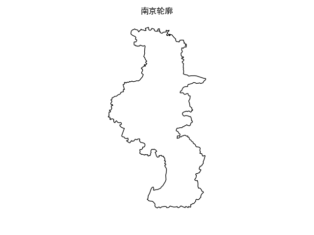

2. 全国地图
```Python
D=Draw_Map()
D.Draw_country(FC=True,arg={'provName':True}) #默认绘制缩略的南海地图
D.Draw_country(FC=True,arg={'provName':False,'city_name':True,'city_pos':True,'sea':True}) #绘制展开的南海地图
```
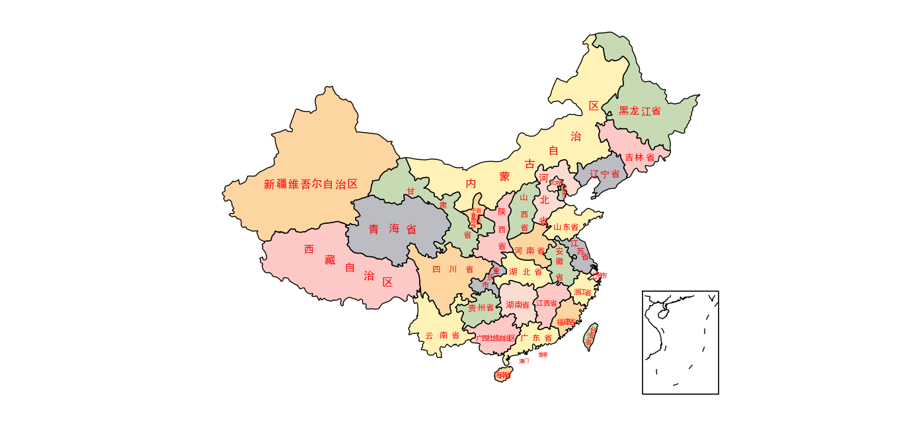
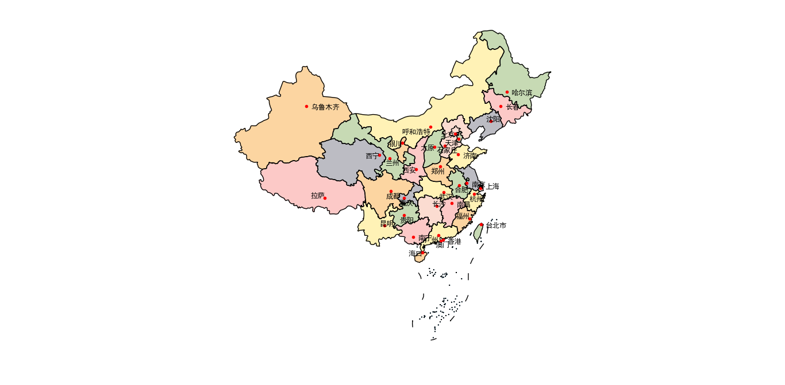

3. 省份地图
```Python
D=Draw_Map()
D.Draw_province('广东',FC=True,LC='w',arg={'other':True,'city_pos':True,'city_name':True})
D.Draw_province('44',LC='w',FC=True,arg={'other':False})
```
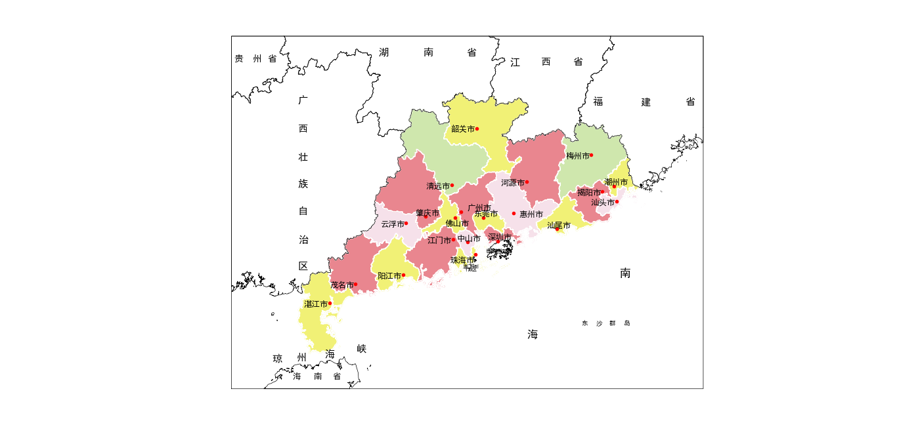
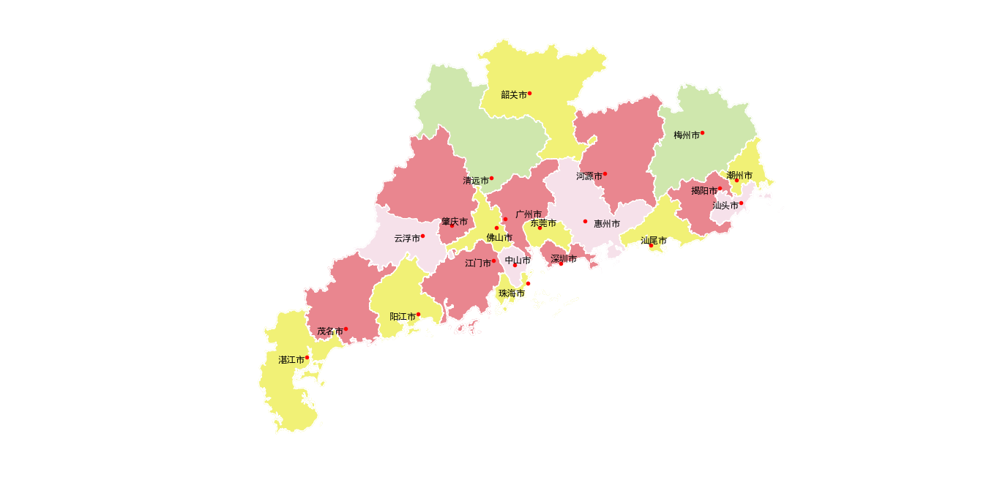

4. 地级行政单位地图
```Python
D=Draw_Map()
D.Draw_city('3201') #南京地图（默认样式）
D.Draw_city('深圳',FC=True,LC='w',arg={'other':True,'city_pos':True,'city_name':True})
```
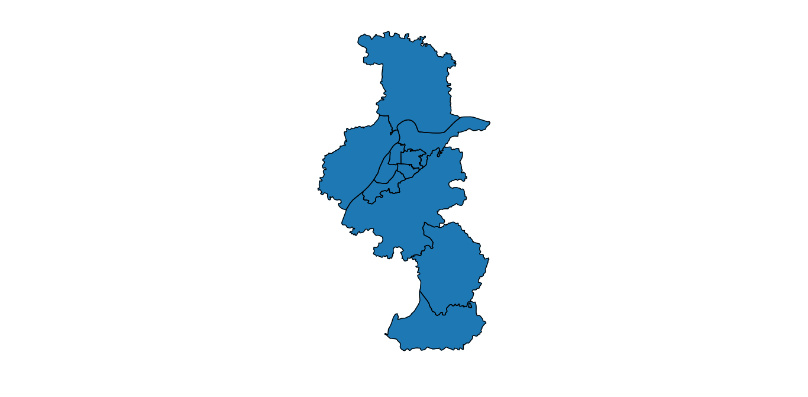
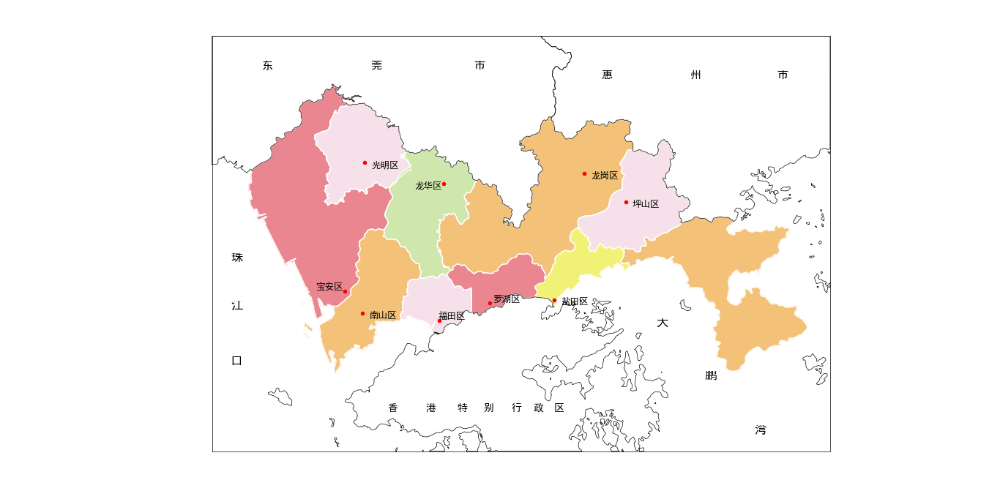

5. 地图数据可视化：将区域颜色与数值大小对应
```Python
D=Draw_Map()
src='Example/GDP-2018.csv'
D.Show_data(src,FC='OrRd',title='2018年各省GDP',arg={'sea':True})  #按数据的绝对大小显示
D.Show_data(src,by_val=False,arg={'default_color':[0.6,0.6,0.6]})  #按数据的相对大小(排名)显示
```
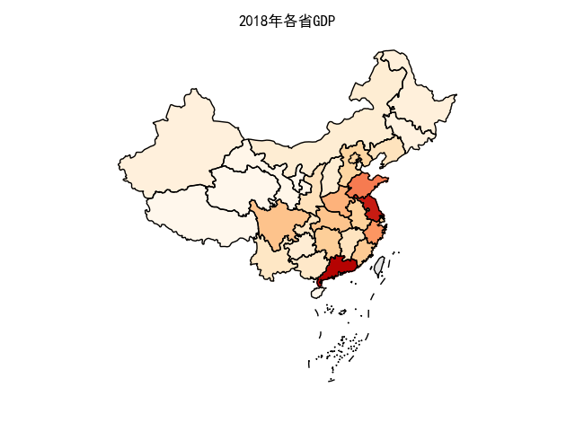
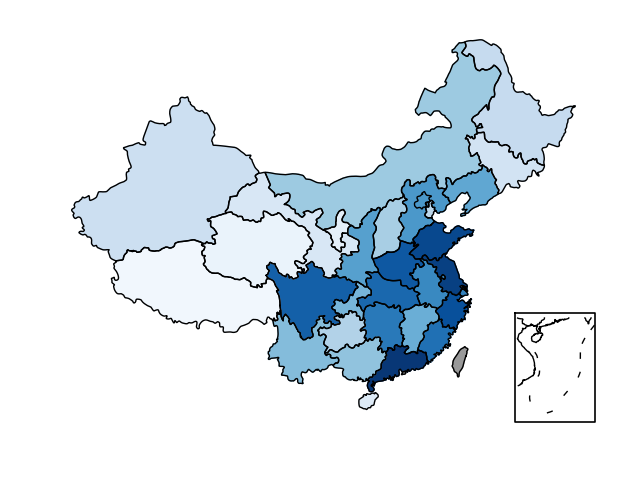


```Python
D.Show_data('Example/江苏人口2018.txt','32',by_val=True,title='江苏人口2018') #省级数据
D.Show_data('Example/江苏人口2018.txt','32',by_val=True,LC='w',\
	title='江苏人口2018',arg={'city_name':True,'city_pos':True,'other':True}) #可配置地图中的样式
```
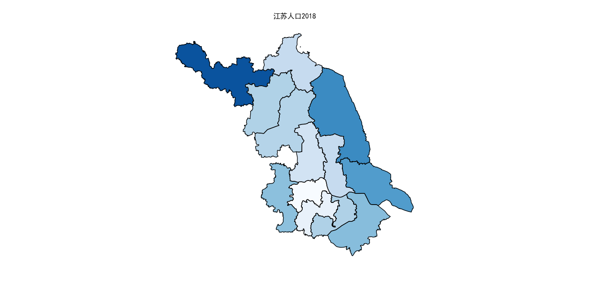
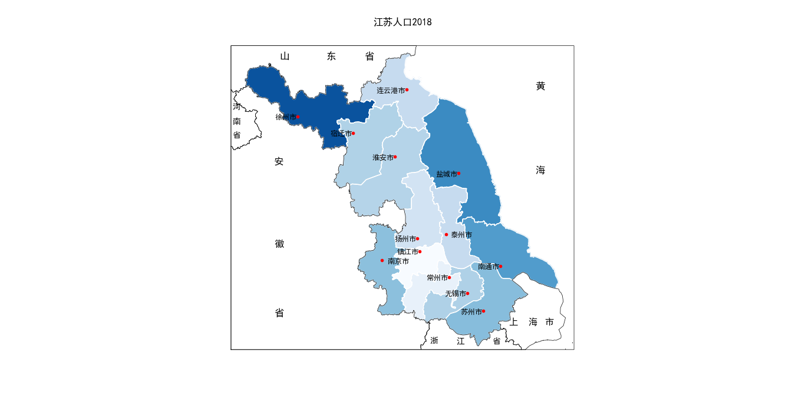

```Python
D.Show_data('Example/Suzhou_population.txt','3205',by_val=False,\
	title='苏州人口2018',arg={'city_name':True,'city_pos':True,'other':True}) #地级数据
```
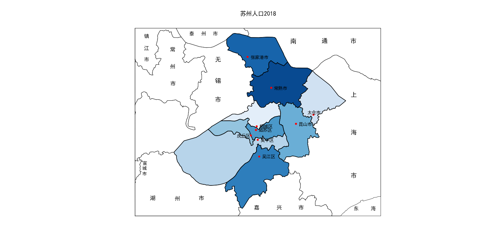

6. 气泡图：将数值大小与圆的半径或颜色对应
```Python
D=Draw_Map()
D.Bubble(src='Example/GDP-2018.csv',img_path='Example/GDP_bubble.png') #更多选项查看：help(D.Bubble)
```
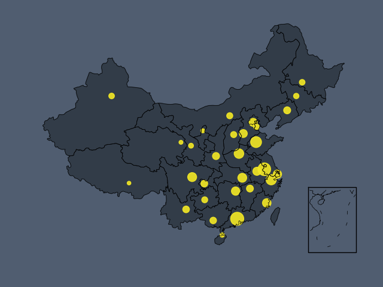


7. 其他
* 查询所有含有某名称的区域编码
```Python
search_region_code('朝阳')
```
输出：
```
辽宁省朝阳市: 211300
北京市朝阳区: 110105
辽宁省朝阳市朝阳县: 211321
吉林省长春市朝阳区: 220104
```

*  查询某个或一组经纬度对应的点在本地图中的坐标
```Python
D=Draw_Map()
val=D.trans_coord([114.313876,30.599835]) 
print(val)
```
输出
```
[583.6755468727599, 393.2750787295468]
```

#### 五、尚未完成的部分

1. 颜色的图例（color map）未完成
2. 部分地图文字注释的位置太近，无法正常显示（如上海的几个市区）
3. 在全国范围内绘制县级行政区划地图耗时太长（主要是县级行政区划数量很多）
4. 无法获取全国范围内地级行政区划的地图数据
5. 尚未获取省级范围内的县级行政区划地图数据
6. 目前只能绘制静态地图，希望加入时间维度，绘制动态可视化地图